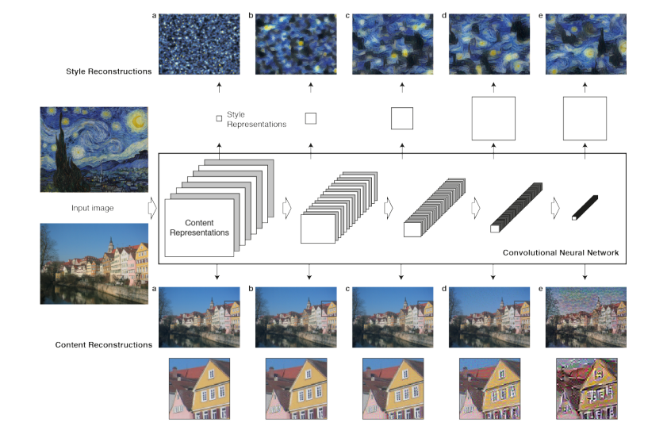
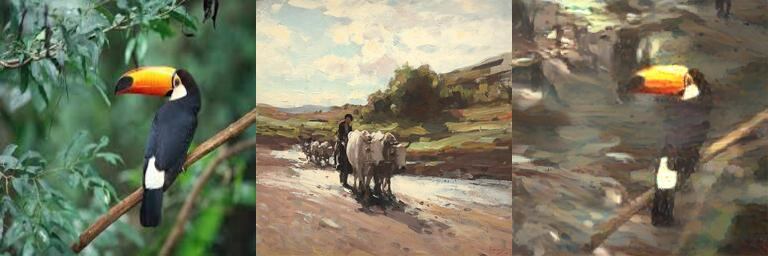
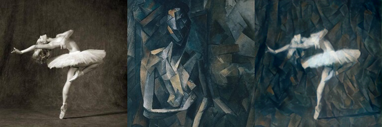
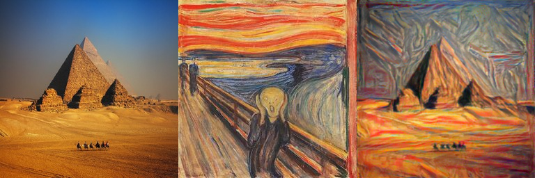

#### Neural Style Transfer
Implementation of Neural Style Transfer from the paper [A Neural Algorithm of Artistic Style](https://arxiv.org/pdf/1508.06576) with PyTorch

#### Requirements:
* [NumPy](http://www.numpy.org/)
* [PyTorch](https://pytorch.org/)
* [Matplotlib](http://matplotlib.org/)
* [Torchinfo](https://github.com/TylerYep/torchinfo)
* [Pillow](https://pillow.readthedocs.io/en/stable/)
* CUDA (GPU) -- Highly Recommended

#### Example 1:

#### Example 2:

#### Example 3:

#### Demo
<a href="https://huggingface.co/spaces/georgescutelnicu/neural-style-transfer">
    </img>
</a>
